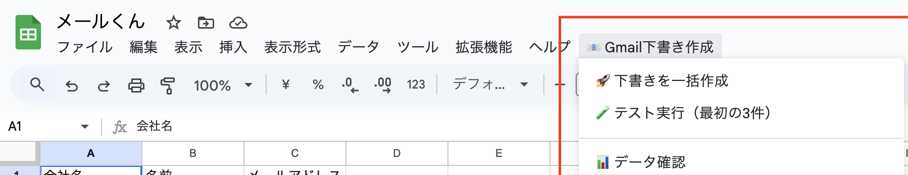

# 📧 Mail-kun（メールくん）

メールくんは、Google スプレッドシートを使用して、複数の宛先に対して一括で Gmail の下書きを作成できる Google Apps Script（GAS）ツールです。

## 🖥️ スクリーンショット



## 🌟 主な機能

- スプレッドシートに入力した複数の宛先に対して、一括でメールの下書きを作成
- テスト実行機能（最初の 3 件のみ）
- サンプルデータの追加機能
- データ確認機能

## 📝 使い方

1. **スプレッドシートの準備**

   - 新しい Google スプレッドシートを作成します
   - スプレッドシートに以下のヘッダーを設定します：
     - A 列：会社名
     - B 列：担当者名
     - C 列：メールアドレス

2. **スクリプトの設定**

   - スプレッドシートのメニューから「拡張機能」→「Apps Script」を選択
   - `Code.gs`の内容をコピーして貼り付けます
   - 「保存」をクリックします

3. **データの入力**

   - スプレッドシートに送信先の情報を入力します
   - または、メニューの「📧 Gmail 下書き作成」→「📝 サンプルデータ追加」でテストデータを追加できます

4. **下書きの作成**
   - メニューの「📧 Gmail 下書き作成」から以下のいずれかを選択：
     - 「🚀 下書きを一括作成」：全ての宛先に対して下書きを作成
     - 「🧪 テスト実行（最初の 3 件）」：最初の 3 件のみテスト実行

## 🔧 カスタマイズ

メールの件名と本文のテンプレートは、`createSubject`関数と`createBody`関数で編集できます：

```javascript
function createSubject(companyName, name) {
  return `【${companyName}】${name}様へのご提案`;
}

function createBody(companyName, name) {
  // 本文のテンプレートをカスタマイズ
}
```

## ⚠️ 注意事項

- 初回実行時は、必要な権限の承認が求められます
- API の制限により、大量のメールを一度に作成する場合は時間がかかる場合があります
- 実行前に必ずデータの確認をお勧めします（「📊 データ確認」機能を使用）

## 🚫 トラブルシューティング

- メールアドレスが空の行は自動的にスキップされます
- エラーが発生した場合は、実行結果にエラー件数が表示されます
- 処理中にエラーが発生した場合でも、他の宛先の処理は継続されます
